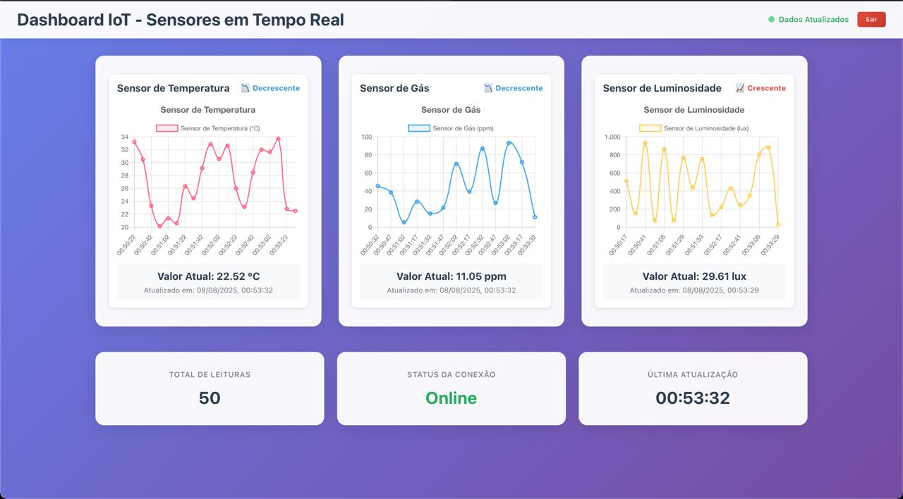
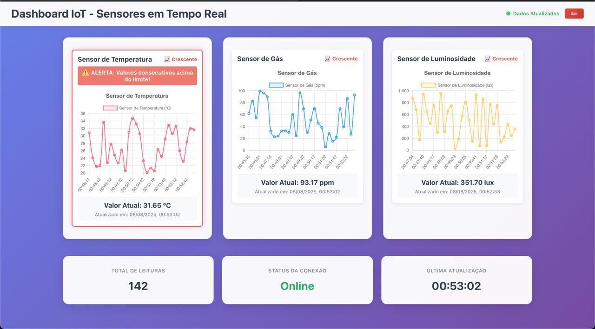
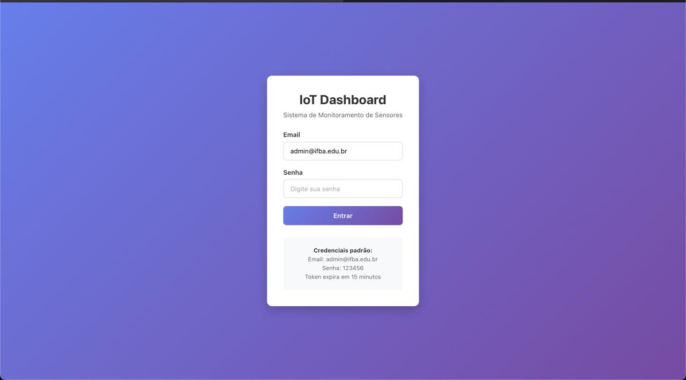
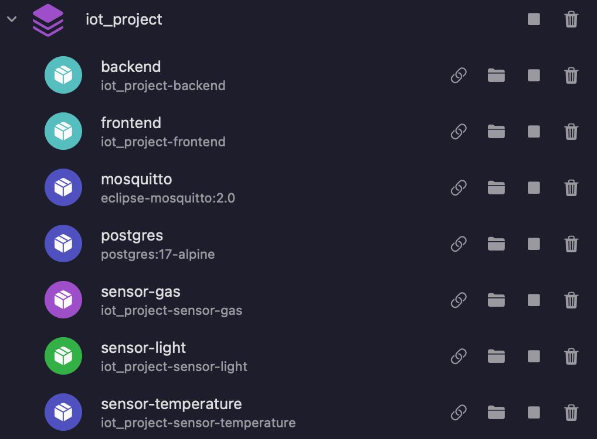

# Relatório Técnico - Miniplataforma IoT

**Instituto Federal de Educação, Ciência e Tecnologia da Bahia**  
**Campus:** Santo Antônio de Jesus  
**Disciplina:** Tópicos Avançados em WEB I  
**Docente:** Felipe Silva  
**Data:** 08/08/2025

---

## 1. Diagrama de Arquitetura


A arquitetura do sistema IoT implementada segue uma abordagem de microsserviços containerizada, composta pelos seguintes componentes principais:

### Componentes da Arquitetura:

1. **Sensores Simulados** (3 containers):
   - Sensor de Temperatura
   - Sensor de Gás
   - Sensor de Luz

2. **Broker MQTT** (Mosquitto):
   - Gerencia a comunicação assíncrona entre sensores e backend
   - Porta 1883 para MQTT e 9001 para WebSocket

3. **Backend API** (Node.js/Express):
   - Processa dados dos sensores
   - API REST com autenticação JWT
   - Análise preditiva e alertas

4. **Banco de Dados** (PostgreSQL):
   - Armazenamento persistente dos dados dos sensores
   - Estrutura otimizada para consultas temporais

5. **Frontend Web** (React):
   - Dashboard em tempo real
   - Visualização de gráficos e alertas
   - Interface responsiva

6. **Proxy Reverso** (Nginx):
   - Servidor web para o frontend
   - Otimização de recursos estáticos

---

## 2. Justificativa de Escolha do Protocolo e API

### 2.1 Protocolo MQTT

A escolha do protocolo **MQTT (Message Queuing Telemetry Transport)** foi fundamentada nos seguintes aspectos:

**Vantagens:**
- **Leveza**: Protocolo otimizado para dispositivos IoT com recursos limitados
- **Eficiência de Rede**: Baixo overhead de dados, ideal para transmissão de sensores
- **Modelo Publish/Subscribe**: Desacoplamento entre produtores e consumidores de dados
- **QoS (Quality of Service)**: Garantia de entrega conforme necessidade
- **Persistência**: Capacidade de manter conexões e mensagens mesmo com falhas temporárias

**Implementação:**
```javascript
// Exemplo de publicação de dados do sensor
client.publish(`sensors/${sensorType}`, JSON.stringify({
  value: sensorValue,
  timestamp: new Date().toISOString(),
  unit: unit
}));
```

### 2.2 API RESTful

A API foi desenvolvida seguindo os princípios **REST (Representational State Transfer)**:

**Características Implementadas:**
- **Recursos Bem Definidos**: Endpoints claros para cada tipo de sensor
- **Métodos HTTP Apropriados**: GET para consultas, POST para criação
- **Representação JSON**: Formato padronizado de dados
- **Stateless**: Cada requisição contém todas as informações necessárias
- **Códigos de Status HTTP**: Respostas padronizadas (200, 401, 403, 500)

**Endpoints Principais:**
```
GET  /api/sensors/{type}/latest     - Últimas leituras
GET  /api/sensors/{type}/predict    - Predição de valores
GET  /api/sensors/{type}/analysis   - Análise de tendências
POST /api/auth/login               - Autenticação
POST /api/auth/validate            - Validação de token
```

---

## 3. Descrição da Análise Simples Implementada

### 3.1 Algoritmos de Análise Preditiva

O sistema implementa três tipos principais de análise:

#### **3.1.1 Média Móvel Simples**
```typescript
async function getMovingAverage(sensorType: string, windowSize: number = 5): Promise<number | null> {
  // Calcula a média dos últimos N valores para suavizar flutuações
  const values = await getLatestValues(sensorType, windowSize);
  return values.reduce((sum, value) => sum + value, 0) / values.length;
}
```

#### **3.1.2 Regressão Linear para Predição**
- **Método**: Regressão linear simples baseada nos últimos 10 valores
- **Cálculo da Tendência**: Análise do coeficiente angular da reta
- **Confiança**: Baseada no coeficiente de determinação (R²)
- **Categorização**: Tendência crescente, decrescente ou estável

```typescript
const slope = (n * sumXY - sumX * sumY) / (n * sumXX - sumX * sumX);
const predictedValue = slope * n + intercept;
const trend = Math.abs(slope) > 0.5 ? (slope > 0 ? 'increasing' : 'decreasing') : 'stable';
```

#### **3.1.3 Sistema de Alertas Reativos**
- **Temperatura**: Alerta quando > 30°C por duas leituras consecutivas
- **Gás**: Alerta quando > 50 ppm por duas leituras consecutivas
- **Luz**: Alerta quando > 800 lux por duas leituras consecutivas

### 3.2 Implementação no Frontend

O sistema exibe análises em tempo real através de:

**Dashboard Principal:**


**Dashboard com Alertas:**


### 3.3 Funcionalidades Analíticas

1. **Gráficos em Tempo Real**: Atualização automática a cada 5 segundos
2. **Indicadores de Tendência**: Setas visuais indicando direção da tendência
3. **Alertas Visuais**: Mudança de cor e notificações quando limites são excedidos
4. **Predição Exibida**: Valor previsto com nível de confiança

---

## 4. Segurança e Autenticação

### 4.1 Autenticação JWT
- **Token JWT**: Implementação com expiração de 15 minutos
- **Refresh Token**: Sistema de renovação automática
- **Hash de Senha**: Utilização do bcrypt para segurança

### 4.2 Níveis de Acesso
- **Rotas Públicas**: Consulta de dados básicos sem autenticação
- **Rotas Protegidas**: Análises avançadas requerem token válido

**Tela de Login:**


---

## 5. Infraestrutura e Deploy

### 5.1 Containerização Docker
O sistema utiliza **Docker Compose** para orquestração de containers:



**Containers Implementados:**
- `iot_postgres`: Banco de dados PostgreSQL
- `iot_mosquitto`: Broker MQTT
- `iot_backend`: API Node.js/Express
- `iot_frontend`: Interface React/Nginx
- `iot_sensor_temperature`: Simulador de temperatura
- `iot_sensor_gas`: Simulador de gás
- `iot_sensor_light`: Simulador de luz

### 5.2 Redes e Volumes
- **Rede Personalizada**: `iot_network` para comunicação entre containers
- **Volumes Persistentes**: Dados do PostgreSQL e Mosquitto

### 5.3 Comando de Execução
```bash
docker-compose up -d
```

---

## 6. Tecnologias Utilizadas

### Backend:
- **Node.js + Express**: Framework web
- **TypeScript**: Tipagem estática
- **PostgreSQL**: Banco de dados relacional
- **MQTT.js**: Cliente MQTT
- **JWT**: Autenticação
- **bcryptjs**: Hash de senhas

### Frontend:
- **React**: Biblioteca de interface
- **Chart.js**: Gráficos interativos
- **Bootstrap**: Framework CSS responsivo
- **Fetch API**: Comunicação com backend

### Infraestrutura:
- **Docker + Docker Compose**: Containerização
- **Nginx**: Servidor web
- **Eclipse Mosquitto**: Broker MQTT

---

## 7. Conclusões

O sistema IoT desenvolvido atende integralmente aos requisitos especificados, implementando:

✅ **Sensores simulados** com envio de dados via MQTT  
✅ **Backend funcional** com API RESTful completa  
✅ **Interface web responsiva** com gráficos e alertas em tempo real  
✅ **Análise preditiva** baseada em regressão linear e médias móveis  
✅ **Docker funcional** com execução completa em containers  
✅ **Segurança implementada** com autenticação JWT e documentação de API

O projeto demonstra uma arquitetura escalável e modular, adequada para cenários reais de IoT, com potencial para expansão e integração com dispositivos físicos.
